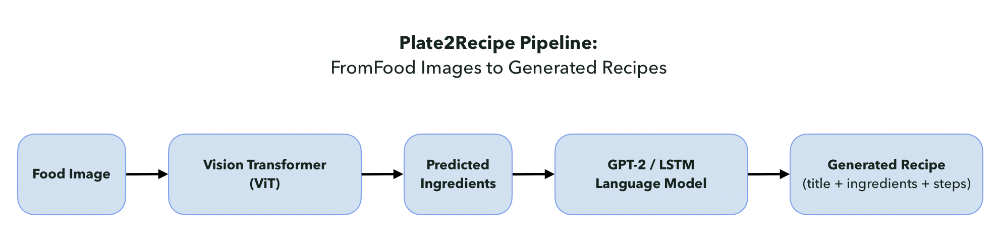

# Plate2Recipe 
### *From Food Images to Structured Recipes*
> End-to-end multimodal system that takes a food image and generates a structured recipe (ingredients + steps) by combining computer vision (ViT) and language generation (GPT-2/LSTMs).

[]()
[]()
[]()
[]()

## TL;DR
- **Problem:** Convert a single food image into a coherent, structured recipe.
- **Approach:** ViT for multi-label ingredient recognition → ingredients condition and prompt GPT-2/LSTM to generate steps.
- **Outcome:** Fluent, structured recipes with strong ingredient recall; surfaced challenges in multimodal alignment and dataset noise.

## Pipeline


*A food image flows through ViT for ingredient recognition, then into GPT-2/LSTM for recipe generation to produce a structured output.*

<details> <summary>ASCII fallback</summary> Image → Preprocess → ViT (ingredients) → Top-K/Synonyms → Prompt → {GPT-2 | LSTM} → Decode → Recipe (title, ingredients, steps) </details>

 
## Features
Multi-label ingredient prediction (ViT), with imbalance-aware loss
Conditional recipe generation (GPT-2 fine-tune + LSTM baseline)
Reproducible configs; supports 10k vs 100k+ recipe training regimes

## Datasets
- **Food-101:** ~101k labeled food images (101 classes)
- **Recipe1M+:** image–recipe pairs for ingredient/step supervision
- **RecipeNLG:** 2M+ recipes for language model fine-tuning
<!--See docs/data.md for licensing/usage notes.-->

## Methods & Models

### Vision (ingredients)
- ViT fine-tuned for multi-label prediction
- Compared against CNN baselines (ResNet, EfficientNet)
- Weighted/multi-label loss; synonym normalization

### Language (instructions)
- LSTM sequence generator baseline
- GPT-2 fine-tuned on RecipeNLG for fluency & coherence
- Decoding: beam search and top-k sampling

### System
1. Image → ViT predicts ingredient set
2. Ingredients → prompt builder conditions generator
3. Generator → title + ingredients + step-by-step instructions

## Experiments & Evaluation
- **Image→Ingredients:** ViT > CNN baselines on precision/recall
- **Ingredients→Recipe:** GPT-2 > LSTMs on fluency/coherence (sometimes verbose)
- **End-to-End:** Plausible recipes; occasional ingredient–step mismatch
- **Metrics:** precision/recall (ingredients), BLEU/ROUGE (text), plus human qualitative review 

## Key Challenges
- **Data quality:** noisy labels & synonyms in Recipe1M+
- **Multimodal alignment:** bridging predicted ingredients and generated steps
- **Scalability:** efficient fine-tuning at millions-sample scale

## Report

> For more detail, see the full report: [docs/P2R_Report.pdf](docs/P2R_Report.pdf).


## Setup

```bash
conda env create -f environment.yml
conda activate p2r
```

## Contributors:
- Nellie Cordova
- Martha Dennise Vieyra Enriquez
- Eric Connelly
- Denis Koshelev
